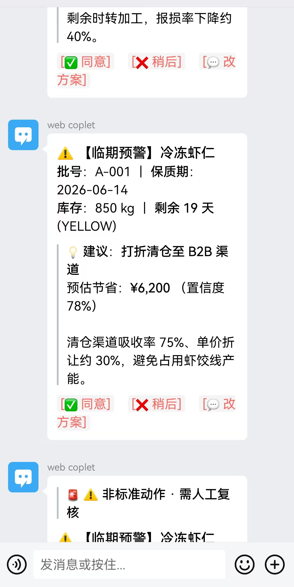
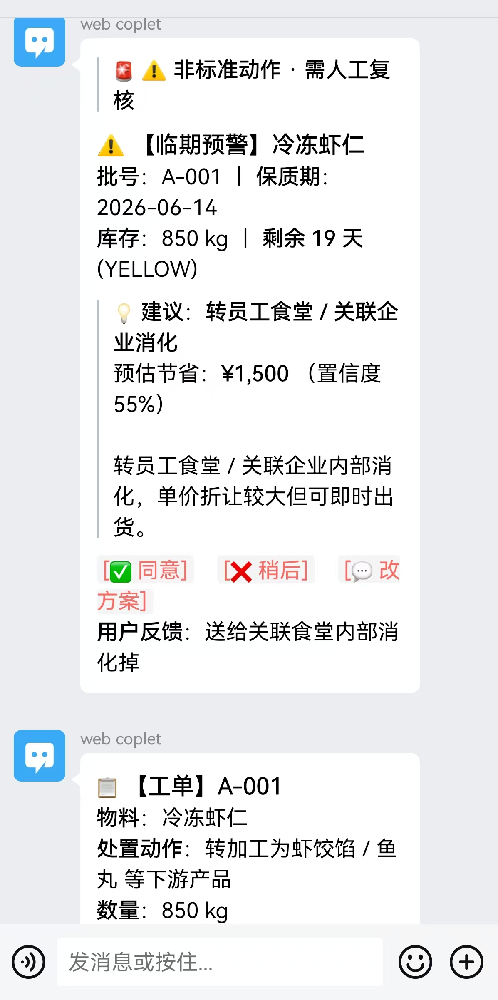
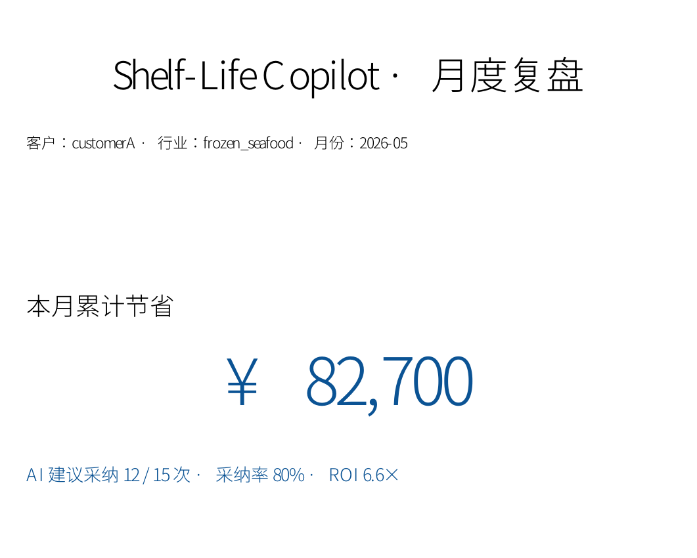
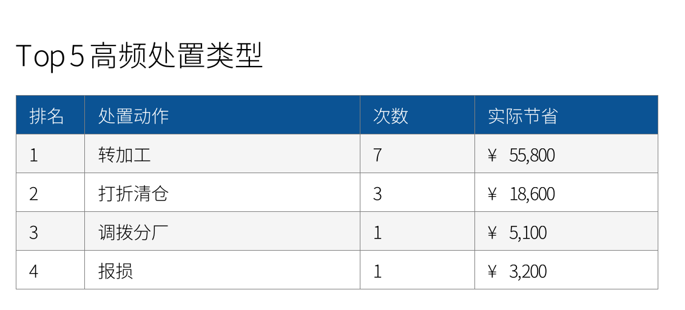
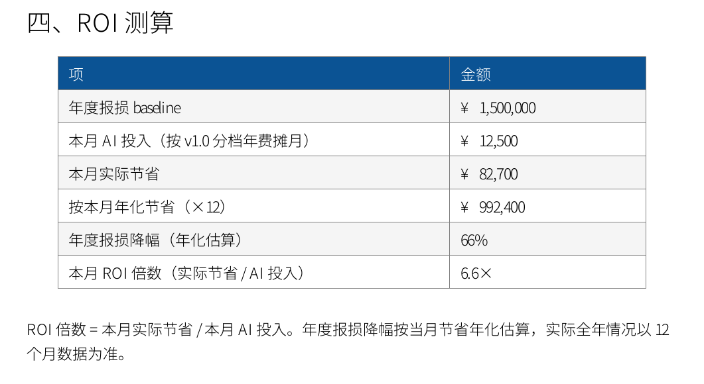

# Shelf-Life Copilot · 食品行业临期 AI 副驾

> **每天早 7 点，把"哪个批次快过期 + 该怎么处置 + 能省多少钱"通过企微卡片推给总监，一键决策、自动派单。**
> 客户 A（年损 150 万）实测：3 个月帮抠回 60-90 万。

[](LICENSE)
[](https://github.com/apaqyang/Shelf-Life-Copilot/actions/workflows/ci.yaml)
[](https://www.python.org/)
[](#)
[](#)

---

## 📸 长这样

### 📱 企微卡片 · 总监手机端

每天早 7:00 推送，3 秒看懂；一键 ✅同意 / ❌稍后 / 💬改方案，同意后自动派工单到车间，非标准动作自动加「需人工复核」标签。

<table>
<tr>
<td width="50%"></td>
<td width="50%"></td>
</tr>
<tr>
<td align="center"><sub>① 早 7:00 临期预警 + AI 处置建议 + 节省估算</sub></td>
<td align="center"><sub>② 总监「改方案」→ 自动生成工单派到车间</sub></td>
</tr>
</table>

### 📄 月度 PDF 报告 · 总监转给老板的汇报材料

封面大字突出累计节省，后面是 Top5 高频处置类型 + ROI 测算明细，一页纸说清"这个月帮你省了多少"。

<table>
<tr>
<td width="34%"></td>
<td width="33%"></td>
<td width="33%"></td>
</tr>
<tr>
<td align="center"><sub>封面：本月累计节省 ¥82,700 · ROI 6.6×</sub></td>
<td align="center"><sub>Top5：AI 都在做哪些处置</sub></td>
<td align="center"><sub>ROI 测算：投入 vs 节省一页讲清</sub></td>
</tr>
</table>

> 以上为 offline 演示模式（mock 数据）渲染效果，`docker compose up` 零配置即可在本机复现，见下方「5 分钟自助试用」。

---

## 🚀 5 分钟自助试用（零配置）

不需要 Anthropic / KIMI API key，不需要企业微信管理员，不需要任何注册。

```bash
git clone https://github.com/apaqyang/Shelf-Life-Copilot.git
cd Shelf-Life-Copilot
docker compose up
```

然后在另一个终端：

```bash
# 跑一次客户 A 的临期扫描，看 AI 在干什么
docker compose exec app uv run python -m src.cli \
  --customer customerA --today 2026-05-26 --provider offline --render-cards

# 离线渲染示例企微卡片到 docs/demo_samples/
docker compose exec app make demo
```

完整食品厂 IT 主管视角 5 步跑通流程：[**docs/QUICKSTART.md →**](docs/QUICKSTART.md)

---

## 🍱 这个工具解决什么问题

食品厂总监每天最头疼的两个数字：

| 痛点 | 现状 | 用了之后 |
|---|---|---|
| 报损率 | 年损 50-300 万，"凭车间经验"猜哪批快过期 | AI 提前 3-25 天预警 + 处置建议（转加工 / 打折清仓 / 员工食堂消化） |
| 决策延迟 | 信息从仓库到总监走 N 个微信群，延迟 1-3 天 | 早 7:00 企微卡片直送总监手机，一键决策 |
| 派单失真 | 总监同意了，车间没收到 / 收到延迟 | 同意自动派工单 @ 车间主任，全程留决策日志 |
| ROI 不透明 | 试了某 SaaS，3 个月后不知道帮没帮到 | 月度 PDF 报告（节省总额 / ROI / 最佳动作）一页纸给老板汇报 |

---

## 🧱 架构一图

```
07:00 DailyScheduler ──┐
                       ↓
                    ScanRunner ──→ AI 建议（offline / KIMI / Claude）
                       ↓
                    企微卡片（群机器人 webhook 或自建应用）
                       ↓
                总监点 ✅ 同意 / ❌ 稍后 / 💬 改方案
                       ↓
            POST /webhook/wecom → DecisionStore (SQLite)
                       ↓
                每月 1 号 MonthlyReportScheduler
                       ↓
            真实数据驱动 → 月度 PDF + 摘要卡推给总监
```

完整模块分层 / 依赖图 / 设计决策见 [docs/ARCHITECTURE.md](docs/ARCHITECTURE.md)。

---

## 💼 商业模式（Open Core）

Apache/GPL 的开源核心保证 **下载即用、源码可审、私有化部署无供应商绑定**。
企业版功能（路径 B 实时回调、ERP 对接、多租户管理后台）按插件商业授权。

| 客户体量 | 推荐档 | 大概 ROI |
|---|---|---|
| 年损 < 100 万 | 开源版自托管，免费 | — |
| 年损 100-300 万 | 商业版 8-15 万 / 年 + 必选插件 | 2-4× |
| 年损 > 300 万 | 议价（建议起步 25 万） + 私有化部署服务 | 4-6× |

想要报价 / 私有化部署 / 3 个月免费 PoC，见下方 [联系 / 商业合作](#-联系--商业合作)。

---

## 📦 模块清单（v0.1 完成度）

| 模块 | 路径 | 状态 |
|---|---|---|
| 监测引擎（3 档预警阈值） | `src/alerts/` | ✅ |
| LLM 建议生成器（Claude / KIMI / offline） | `src/suggestion/` | ✅ |
| 企微卡片（4 模板）+ 群机器人推送 | `src/wecom/` | ✅ |
| 改方案单轮重生成 | `src/scheduler/runner.py::revise_for_batch` | ✅ |
| 决策日志 SQLite 持久化 | `src/persistence/DecisionStore` | ✅ |
| 建议日志 SQLite（让 webhook click 拿真实 action/savings） | `src/persistence/SuggestionStore` | ✅ |
| 月度 PDF 报告 + 摘要卡 + cron 定时 | `src/reports/` + `src/scheduler/monthly.py` | ✅ |
| 路径 B 企微回调（plaintext 骨架） | `src/webhook/` | ✅ |
| 长跑服务入口（FastAPI lifespan + 调度器） | `src/runtime/lifespan.py` | ✅ |
| **企微回调 AES 加解密 + 签名校验** | — | 企业版插件 |
| **ERP 对接插件**（SAP / 用友 / 金蝶 / 自研） | — | ⏳ v0.5+ |

**当前指标**：391 测试 · 100% 覆盖率 · 21+ commits · CI 全绿

---

## 🛠️ 开发者（本地不用 Docker）

```bash
# 装依赖 + pre-commit
make dev

# 跑全套检查（CI 等效）
make check

# offline 模式跑一次扫描（不需要任何 API key）
make scan CUSTOMER=customerA TODAY=2026-05-26 PROVIDER=offline
# 或直接 CLI：
uv run python -m src.cli --customer customerA --today 2026-05-26 --provider offline

# 接真实 LLM（任选其一）
export ANTHROPIC_API_KEY=sk-...
export MOONSHOT_API_KEY=sk-...    # OpenAI 协议，国内可访问
uv run python -m src.cli --customer customerA --provider moonshot --render-cards

# 启动长跑服务（自带 daily/monthly scheduler + /webhook/wecom 回调）
uv run uvicorn src.main:app --host 0.0.0.0 --port 8000
```

更多命令 `make help`，技术细节见 [docs/TECH_SPEC.md](docs/TECH_SPEC.md)。

---

## 📚 文档导航

| 文档 | 看什么 |
|---|---|
| [docs/QUICKSTART.md](docs/QUICKSTART.md) | **食品厂 IT 主管 5 分钟试用指南**（含 FAQ） |
| [docs/blog/](docs/blog/) | **博客**：行业洞察、案例拆解、ROI 测算（深度长文） |
| [docs/TECH_SPEC.md](docs/TECH_SPEC.md) | 技术架构、数据模型、接口设计 |
| [docs/ARCHITECTURE.md](docs/ARCHITECTURE.md) | 分层 / 依赖图 / 设计决策记录 |
| [docs/demo_samples/](docs/demo_samples/) | 现成的卡片样本 + 月度 PDF 报告 |

---

## 📬 联系 / 商业合作

自助试用免费，遇到下面任一情况，欢迎直接找我聊：

- 想接**真实 ERP**（SAP / 用友 / 金蝶 / 自研）或**真实企微回调**（AES 加解密）→ 商业版插件
- 想要**私有化部署**（库存数据不出机房）
- 想做 **3 个月免费 PoC 试点**，拿你厂的真实报损降低数据
- 单纯想了解能不能帮到你们厂，或填一份 5 分钟年损诊断问卷拿报价

| 方式 | 联系方式 |
|---|---|
| 微信 | **apaqyang**（加好友请备注「临期」+ 公司名） |
| GitHub | 提个 [Issue](https://github.com/apaqyang/Shelf-Life-Copilot/issues) 或直接发起讨论 |

---

## 📜 License

[AGPL-3.0-or-later](LICENSE) — 您可以自由使用、修改、分发本项目；如果以网络服务形式提供，
必须把您修改的源码公开（AGPL 网络条款）。商业版企业插件单独商业许可，
请通过上面的[联系方式](#-联系--商业合作)与作者洽谈。

> **食品厂 IT 主管须知**：AGPL 不影响您自己内部使用，无论改不改源码都不需要公开。
> 只有当您把本项目作为 SaaS 对**外**售卖时，AGPL §13 才要求公开修改部分。
